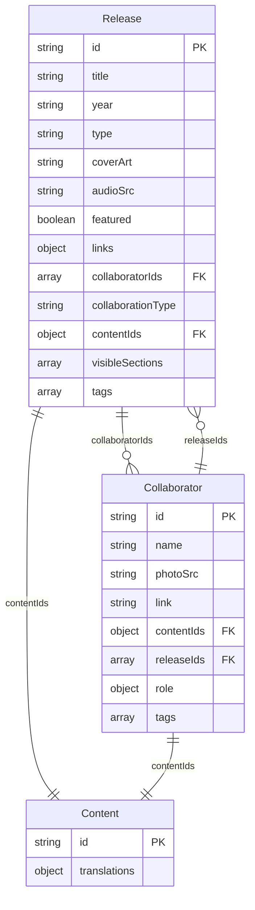

# Consolidated Data Model Design

## 1. Design Principles

### Single Source of Truth
- All release data stored in one location
- Collaborator references instead of duplicate data
- Reference-based relationships like `featured-releases.js`

### Backward Compatibility
- Maintain existing API surface where possible
- Preserve all current functionality
- Gradual migration path

### Extensibility
- Support for multi-collaborator releases
- Flexible tagging and categorization
- Easy to add new relationship types

## 2. New Data Structure

### Enhanced Release Schema
```javascript
/**
 * @typedef {Object} Release
 * @property {string} id - Unique identifier for the release
 * @property {string} title - Title of the release
 * @property {string} year - Release year (4-digit string)
 * @property {string} type - Type of release ("single" or "album")
 * @property {string} coverArt - Path to cover art image relative to root
 * @property {string} audioSrc - Path to audio file relative to root
 * @property {boolean} featured - Whether this release is featured on the homepage
 * @property {Object} links - Platform-specific links for streaming/purchasing
 * @property {string[]} collaboratorIds - Array of collaborator IDs who contributed
 * @property {Object} contentIds - IDs for related content in other data modules
 * @property {string[]} visibleSections - Which sections should be visible in the release details panel
 * @property {string[]} tags - Tags for filtering and searching
 * @property {string} collaborationType - Type of collaboration (optional: "featured", "co-written", "produced", etc.)
 */
```

### Enhanced Collaborator Schema
```javascript
/**
 * @typedef {Object} Collaborator
 * @property {string} id - Unique identifier for the collaborator
 * @property {string} name - Name of the collaborator
 * @property {string} photoSrc - Path to collaborator photo relative to root
 * @property {string} link - Link to collaborator's external page
 * @property {Object} contentIds - IDs for related content in other data modules
 * @property {string[]} releaseIds - Array of release IDs contributed by this collaborator
 * @property {string[]} tags - Tags for filtering and searching
 * @property {Object} role - Role information (optional: { primary: string, secondary: string[] })
 */
```

## 3. Consolidated Data Files

### New release-data.js Structure
```javascript
export const releaseData = [
  {
    id: "tendido-cero-sentido",
    title: "Tendido Cero Sentido",
    year: "2025",
    type: "single",
    coverArt: "images/art-tendido-cero-sentido.jpg",
    audioSrc: "audio/single-tendido-cero-sentido.mp3",
    featured: false,
    links: {
      spotify: "https://open.spotify.com/track/1234567890",
      apple: "https://music.apple.com/us/album/tendido-cero-sentido/1234567890?i=1234567890",
      youtube: "https://youtu.be/abcdefghijklmnop",
      bandcamp: "https://lasonoravolcanica.bandcamp.com/track/tendido-cero-sentido"
    },
    collaboratorIds: ["cututo", "piero"], // NEW: Direct reference to collaborators
    collaborationType: "featured", // NEW: Type of collaboration
    contentIds: {
      story: "tendido-cero-sentido-story",
      lyrics: "tendido-cero-sentido-lyrics",
      gallery: "tendido-cero-sentido-gallery"
    },
    visibleSections: ["story", "lyrics", "gallery"],
    tags: ["single", "2025", "collaboration", "bolero", "queer"] // ENHANCED: More comprehensive tags
  },
  // ... other releases (unchanged structure but with collaboratorIds where applicable)
];
```

### New collaborator-data.js Structure
```javascript
export const collaboratorData = [
  {
    id: "cututo",
    name: "Cututo",
    photoSrc: "images/collab-cututo.jpg",
    link: "https://open.spotify.com/artist/3jehqC1A1uGwGwOOtUWBSl?si=kruSiF6LSQmWiWxOdmJ3-w",
    contentIds: {
      bio: "cututo-bio"
    },
    releaseIds: ["tendido-cero-sentido"], // CHANGED: From songIds to releaseIds
    role: { // NEW: Structured role information
      primary: "featured-artist",
      secondary: ["songwriter", "vocalist"]
    },
    tags: ["peru", "bolero", "queer", "featured"]
  },
  {
    id: "piero",
    name: "Piero Fava",
    photoSrc: "images/collab-piero.jpg",
    link: "https://www.instagram.com/pierofava",
    contentIds: {
      bio: "piero-bio"
    },
    releaseIds: ["tendido-cero-sentido"], // CHANGED: From songIds to releaseIds
    role: { // NEW: Structured role information
      primary: "songwriter",
      secondary: ["conceptual-artist"]
    },
    tags: ["tattoo", "painter", "featured"]
  }
];
```

### DEPRECATED: collaborator-songs.js
```javascript
// This file will be deprecated and removed
// All functionality moved to release-data.js with collaboratorIds
```

## 4. Enhanced Data Loader

### New data-loader.js Functions
```javascript
/**
 * Get releases by collaborator ID
 * @param {string} collaboratorId - ID of the collaborator
 * @returns {Array} - Array of releases featuring this collaborator
 */
const getReleasesByCollaborator = (collaboratorId) => {
  return releaseData.filter(release => 
    release.collaboratorIds && release.collaboratorIds.includes(collaboratorId)
  );
};

/**
 * Get collaborators by release ID
 * @param {string} releaseId - ID of the release
 * @returns {Array} - Array of collaborators who contributed to this release
 */
const getCollaboratorsByRelease = (releaseId) => {
  const release = releaseData.find(r => r.id === releaseId);
  if (!release || !release.collaboratorIds) return [];
  
  return release.collaboratorIds.map(collabId => 
    collaboratorData.find(collab => collab.id === collabId)
  ).filter(Boolean);
};

/**
 * Get collaboration releases (releases with collaborators)
 * @returns {Array} - Array of releases that have collaborators
 */
const getCollaborationReleases = () => {
  return releaseData.filter(release => 
    release.collaboratorIds && release.collaboratorIds.length > 0
  );
};

/**
 * Unified release getter (works for both main releases and collaborations)
 * @param {string} releaseId - ID of the release
 * @returns {Object|null} - Release object or null if not found
 */
const getRelease = (releaseId) => {
  return releaseData.find(release => release.id === releaseId) || null;
};
```

## 5. Data Relationship Diagram



## 6. Migration Benefits

### Eliminated Redundancy
- Single source of truth for all release data
- No duplicate information across files
- Consistent data structure

### Improved Relationships
- Clear bidirectional references
- Support for multi-collaborator releases
- Structured role information

### Enhanced Querying
- Unified data access patterns
- Simplified filtering and searching
- Better performance with indexed lookups

### Future Extensibility
- Easy to add new collaboration types
- Support for complex relationships
- Scalable for larger catalogs

## 7. Backward Compatibility Strategy

### API Preservation
```javascript
// Keep existing function signatures but delegate to new implementation
const getCollaboratorSong = (songId) => {
  // Delegate to new unified getRelease function
  return getRelease(songId);
};

// Maintain collaborator.songIds compatibility
const enhancedCollaboratorData = collaboratorData.map(collab => ({
  ...collab,
  // Add computed property for backward compatibility
  get songIds() { return this.releaseIds; }
}));
```

### Gradual Migration Path
1. Add new fields alongside existing ones
2. Update data access methods gradually
3. Remove deprecated fields after validation
4. Clean up unused code paths