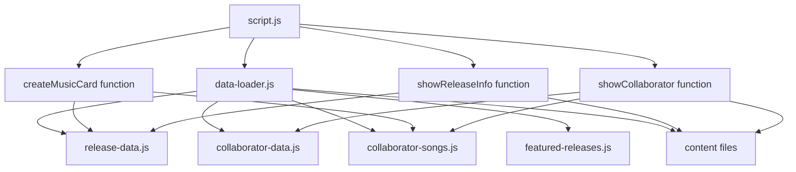

# Data Architecture Analysis for La Sonora Volcánica

## 1. Complete Data Flow and Dependencies

### Current Data Structure
```
data/
├── releases/
│   ├── release-data.js (main release catalog)
│   └── featured-releases.js (ID references only)
├── collaborators/
│   ├── collaborator-data.js (collaborator profiles)
│   └── collaborator-songs.js (duplicate release data)
├── content/
│   ├── release-stories.js (multilingual content)
│   ├── release-lyrics.js (multilingual content)
│   └── collaborator-bios.js (multilingual content)
└── config/
    ├── app-config.js
    └── platform-config.js
```

### Data Flow Diagram


## 2. Data Duplication and Inconsistencies

### Critical Issue: "tendido-cero-sentido" Duplication

#### In release-data.js (lines 168-189):
```javascript
{
  id: "tendido-cero-sentido",
  title: "Tendido Cero Sentido",
  year: "2025",
  type: "single",
  coverArt: "images/art-tendido-cero-sentido.jpg",
  audioSrc: "audio/single-tendido-cero-sentido.mp3",
  featured: false,
  links: {
    spotify: "https://open.spotify.com/track/1234567890",
    apple: "https://music.apple.com/us/album/tendido-cero-sentido/1234567890?i=1234567890",
    youtube: "https://youtu.be/abcdefghijklmnop",
    bandcamp: "https://lasonoravolcanica.bandcamp.com/track/tendido-cero-sentido"
  },
  contentIds: {
    story: "tendido-cero-sentido-story",
    lyrics: "tendido-cero-sentido-lyrics",
    gallery: "tendido-cero-sentido-gallery"
  },
  visibleSections: ["story", "lyrics","gallery"],
  tags: ["single", "2025", "collaboration"]
}
```

#### In collaborator-songs.js (lines 17-36):
```javascript
"tendido-cero-sentido": {
  id: "tendido-cero-sentido",
  title: "Tendido Cero Sentido",
  year: "2025",
  coverArt: "images/art-tendido-cero-sentido.jpg",
  audioSrc: "audio/single-tendido-cero-sentido.mp3",
  links: {
    spotify: "https://open.spotify.com/track/1234567890",
    apple: "https://music.apple.com/us/album/tendido-cero-sentido/1234567890?i=1234567890",
    youtube: "https://youtu.be/abcdefghijklmnop",
    bandcamp: "https://lasonoravolcanica.bandcamp.com/track/tendido-cero-sentido"
  },
  contentIds: {
    story: "tendido-cero-sentido-story",
    lyrics: "tendido-cero-sentido-lyrics",
    gallery: "tendido-cero-sentido-gallery"
  },
  visibleSections: ["story", "lyrics"],
  collaboratorIds: ["cututo", "piero"]
}
```

### Identified Inconsistencies:

1. **Structural Differences**:
   - `release-data.js` uses array format, `collaborator-songs.js` uses object format
   - Different field names for similar concepts (`tags` vs `collaboratorIds`)
   - `visibleSections` differs: `["story", "lyrics","gallery"]` vs `["story", "lyrics"]`

2. **Data Duplication**:
   - identical basic information (id, title, year, coverArt, audioSrc)
   - identical links object
   - identical contentIds object
   - 100% redundancy for this release

3. **Access Pattern Inconsistencies**:
   - Releases accessed via `dataLoader.releases` (array)
   - Collaborator songs accessed via `dataLoader.getCollaboratorSong(id)` (object lookup)
   - Different processing logic in `script.js`

## 3. featured-releases.js Best Practices Analysis

### Why featured-releases.js is Better:

1. **Reference-Based Approach**:
   ```javascript
   export const featuredReleases = [
     "cumbia-del-barrio",
     "sol-sol"
   ];
   ```
   - Stores only IDs, not duplicate data
   - References main data source
   - Single source of truth principle

2. **Separation of Concerns**:
   - Content data separated from presentation logic
   - Feature selection independent of release metadata
   - Easy to modify without touching core data

3. **Performance Benefits**:
   - Smaller memory footprint
   - Faster loading (no duplicate data)
   - Easier caching strategies

## 4. Current Architecture Problems

### Maintenance Issues:
- Must update two files when modifying "tendido-cero-sentido"
- Risk of inconsistencies during updates
- Double the effort for data entry

### Code Complexity:
- Different data access patterns for similar content
- Conditional logic in `script.js` to handle both types
- Inconsistent data validation

### Scalability Issues:
- Each collaboration requires duplicate entry
- No clear pattern for multi-collaborator releases
- Difficult to query across all releases uniformly

## 5. Impact Analysis

### Files Requiring Changes:
1. `data/releases/release-data.js` - Add collaborator references
2. `data/collaborators/collaborator-songs.js` - REMOVE/DEPRECATE
3. `data/collaborators/collaborator-data.js` - Update song references
4. `scripts/data-loader.js` - Remove collaborator songs handling
5. `script.js` - Update music card creation and display logic

### Risk Assessment:
- **High Risk**: Breaking existing collaborator display functionality
- **Medium Risk**: Data migration errors
- **Low Risk**: Performance improvements after consolidation