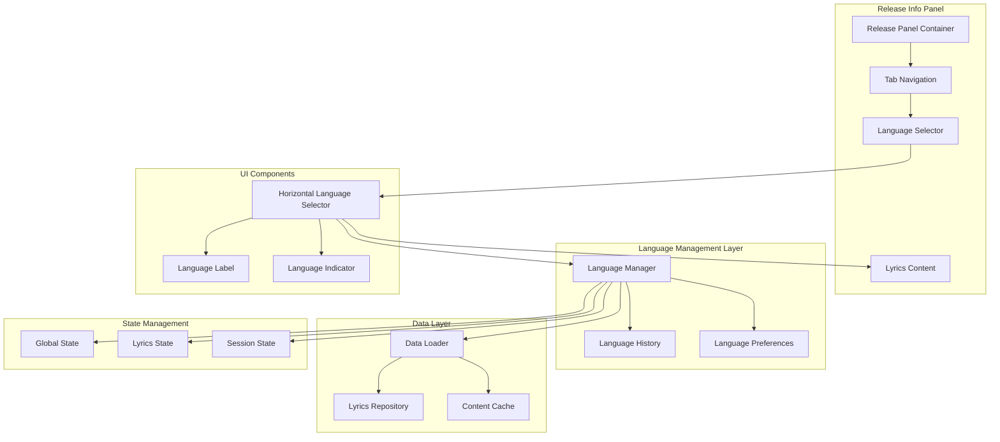
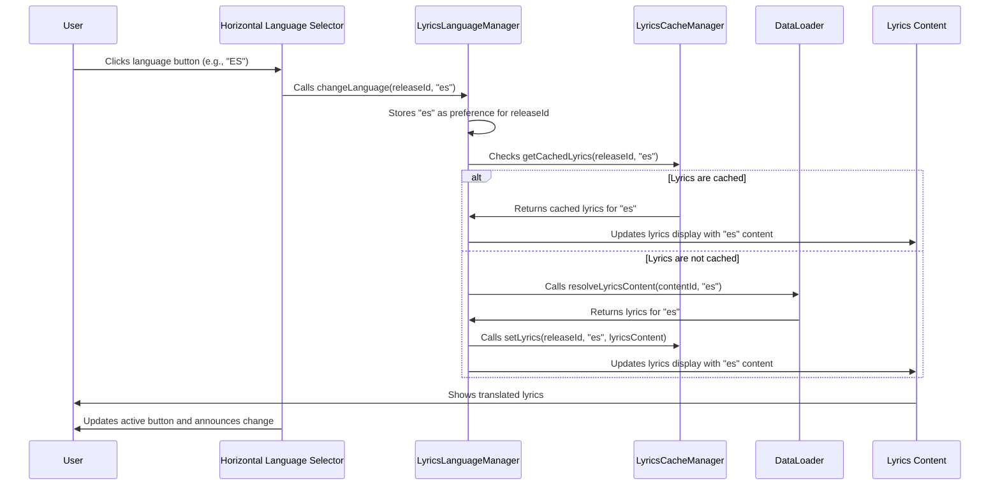
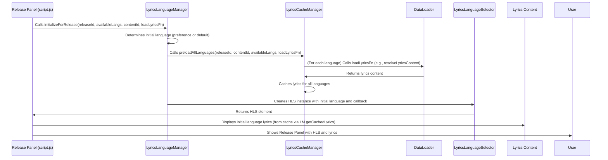

# Multi-Language Lyrics Feature Architecture

## Overview

This document outlines the architecture for a comprehensive multi-language lyrics feature within the release info panel of the La Sonora Volcánica music application. The feature allows users to instantly switch between available lyric translations independently from the global language setting, with persistent preferences and efficient caching.

## System Architecture Diagram



## Component Breakdown

### 1. Horizontal Language Selector Component (`LyricsLanguageSelector` Class)

**File Location**: [`script.js`](script.js:1845) (Implemented as a class within the main script file for simplicity and tight integration)

**Responsibilities**:
- Render horizontal language buttons for available lyric translations.
- Highlight the currently selected language with visual indicators.
- Handle language switching events (click, keyboard navigation, swipe gestures).
- Ensure accessibility with ARIA attributes, keyboard support, and screen reader announcements.
- Maintain visual consistency with existing design patterns and responsiveness.

**Key Methods**:
- `create()`: Creates the language selector DOM element.
- `createLanguageButton(langCode, index)`: Generates individual language buttons.
- `bindEvents()`: Attaches event listeners for user interactions.
- `selectLanguage(languageCode)`: Updates UI and triggers language change callback.
- `announceLanguageChange(newLanguage, previousLanguage)`: Informs screen readers of language changes.
- `handleArrowNavigation(e)`, `handleHomeKey(e)`, `handleEndKey(e)`, `handleKeySelection(e)`, `handleEscapeKey(e)`: Implement robust keyboard navigation.
- `handleTouchStart(e)`, `handleTouchEnd(e)`: Support swipe gestures for language switching.
- `checkScrollable(container)`, `updateScrollIndicators()`: Manage scroll behavior and visual indicators for overflow.
- `updateLanguages(availableLanguages, currentLanguage)`: Re-renders the selector with new language data.
- `focusActiveButton()`: Sets focus to the currently active language button.
- `getLanguageName(langCode)`: Provides a display name for a given language code.
- `showLanguageUnavailableError(languageCode)`: Visually indicates unavailable languages.

### 2. Language Manager (`LyricsLanguageManager` Class)

**File Location**: [`script.js`](script.js:1639) (Implemented as a class within the main script file for simplicity and tight integration)

**Responsibilities**:
- Manage lyrics language state independently from global UI language settings.
- Track and persist language preferences for each release in session storage.
- Determine the initial language to display based on user preferences or defaults.
- Coordinate with the `LyricsCacheManager` for efficient content retrieval.
- Preload all language versions for a release upon initialization.

**Key Methods**:
- `constructor(defaultLanguage, cacheManager)`: Initializes with the global default language and a `LyricsCacheManager` instance.
- `getStoredLanguagePreference(releaseId)`: Retrieves stored language preference for a specific release from session storage.
- `storeLanguagePreference(releaseId, languageCode)`: Persists the selected language preference to session storage.
- `getInitialLanguage(releaseId, availableLanguages)`: Determines the most appropriate initial language for a given release.
- `initializeForRelease(releaseId, availableLanguages, contentId, loadLyricsFunction)`: Sets up the manager for a release, preloading lyrics and setting the current language.
- `changeLanguage(releaseId, newLanguage)`: Updates the current language and stores the preference, returning the previous language.
- `getCurrentLanguage()`, `getAvailableLanguages()`, `isLanguageAvailable(languageCode)`: Provide access to current language state and availability.
- `getCachedLyrics(releaseId, language)`, `hasCachedLyrics(releaseId, language)`: Interact with the cache manager to retrieve or check for cached lyrics.
- `getPreloadedContent(releaseId)`: Retrieves all preloaded content for a release.
- `reset()`: Resets the manager's state for a new release.

### 3. Lyrics Cache Manager (`LyricsCacheManager` Class)

**File Location**: [`script.js`](script.js:2383) (Implemented as a class within the main script file for simplicity and tight integration)

**Responsibilities**:
- Efficiently cache lyric translations using a multi-level strategy (in-memory and session storage).
- Implement an LRU (Least Recently Used) eviction policy for the in-memory cache.
- Provide fast access to previously loaded translations to ensure instant language switching.
- Manage memory usage and session storage limits to prevent excessive resource consumption.
- Preload all available language versions for a release to enable seamless switching.

**Key Methods**:
- `constructor(config)`: Initializes with configuration options for cache sizes and storage keys.
- `initializeSessionStorage()`: Loads existing data from session storage.
- `getLyrics(releaseId, language)`: Retrieves lyrics from cache (prioritizing memory cache).
- `setLyrics(releaseId, language, lyrics)`: Stores lyrics in both caches, triggering cleanup if necessary.
- `preloadAllLanguages(releaseId, contentId, availableLanguages, loadLyricsFunction)`: Asynchronously loads and caches all provided language versions for a release.
- `updateAccessOrder(cacheKey)`: Updates the access timestamp for LRU tracking.
- `cleanupMemoryCache()`: Evicts least recently used entries from the in-memory cache.
- `cleanupSessionStorage()`: Evicts oldest entries from session storage.
- `persistSessionStorage()`: Saves the current session cache to `sessionStorage`.
- `invalidateRelease(releaseId)`: Removes all cached lyrics for a specific release from both caches.
- `invalidateAll()`: Clears both caches completely.
- `getStats()`: Returns current cache statistics (hits, misses, sizes).
- `hasLyrics(releaseId, language)`: Checks if lyrics are present in the cache.
- `getCachedLanguages(releaseId)`: Returns an array of language codes cached for a specific release.

### 4. Enhanced Data Loader Integration

**File Location**: `scripts/data-loader.js` (extension)

**Responsibilities**:
- Extend existing resolveContent function for lyrics-specific language handling
- Provide bulk loading of all language versions for a release
- Integrate with caching system for optimal performance

**Key Methods**:
- `resolveLyricsContent(contentId, languageCode)`
- `loadAllLyricsLanguages(contentId)`
- `getAvailableLyricsLanguages(contentId)`

## Data Flow Diagrams

### Language Switching Flow



### Initial Load Flow



## State Management Approach

### 1. Lyrics Language State

**Location**: Session Storage + In-Memory State

```javascript
// Session Storage Structure
{
  "lyricsLanguagePreferences": {
    "releaseId1": "es",
    "releaseId2": "fr",
    "lastSelected": "es"
  },
  "currentSession": {
    "activeRelease": "releaseId1",
    "currentLanguage": "es"
  }
}
```

### 2. Cache State

**Location**: In-Memory with Persistence Fallback

```javascript
// Cache Structure
{
  "lyricsCache": {
    "releaseId1": {
      "en": "Lyrics content...",
      "es": "Contenido de letras...",
      "fr": "Paroles..."
    },
    "releaseId2": { ... }
  },
  "cacheMetadata": {
    "lastAccessed": timestamp,
    "size": number,
    "maxSize": 100
  }
}
```

### 3. Language Selection History

**Location**: In-Memory Array

```javascript
// History Structure
{
  "languageHistory": [
    { releaseId: "releaseId1", language: "es", timestamp: 12345 },
    { releaseId: "releaseId2", language: "fr", timestamp: 12346 }
  ],
  "maxHistorySize": 50
}
```

## Caching Strategy

### 1. Multi-Level Caching

**Level 1: In-Memory Cache**
- Fastest access for frequently used lyrics
- Implements LRU (Least Recently Used) eviction
- Limited to ~50 releases with all language versions

**Level 2: Session Storage Cache**
- Persists across page reloads within session
- Larger capacity (~200 releases)
- Asynchronous save/load operations

**Level 3: Preload Strategy**
- Loads all language versions when first accessing a release
- Background loading for predicted next releases
- Intelligent prioritization based on user patterns

### 2. Cache Optimization Techniques

```javascript
// Cache implementation example
class LyricsCache {
  constructor(maxSize = 50) {
    this.cache = new Map();
    this.accessOrder = new Map();
    this.maxSize = maxSize;
  }
  
  get(releaseId, language) {
    const key = `${releaseId}-${language}`;
    if (this.cache.has(key)) {
      this.updateAccessOrder(key);
      return this.cache.get(key);
    }
    return null;
  }
  
  set(releaseId, language, content) {
    const key = `${releaseId}-${language}`;
    
    // Evict if at capacity
    if (this.cache.size >= this.maxSize) {
      this.evictLeastRecentlyUsed();
    }
    
    this.cache.set(key, content);
    this.updateAccessOrder(key);
  }
  
  preloadAllLanguages(releaseId, lyricsData) {
    Object.keys(lyricsData).forEach(lang => {
      this.set(releaseId, lang, lyricsData[lang]);
    });
  }
}
```

## Integration Points with Existing Codebase

### 1. Release Info Panel Integration

**File**: [`script.js`](script.js:863)

**Integration Point**: The `showReleaseInfo` function within `script.js` has been significantly modified to integrate the multi-language lyrics feature.

```javascript
// Original lyrics pane creation (simplified)
// const lyricsP = document.createElement('p');
// lyricsP.textContent = dataLoader.resolveContent(release.contentIds.lyrics, 'lyrics', currentLang);

// Enhanced implementation within showReleaseInfo:
// ... (lines before lyricsPane creation)

                    const lyricsPane = document.createElement('div');
                    lyricsPane.className = 'song-info-content';
                    if (!hasStory) lyricsPane.classList.add('active'); // Make first pane active
                    
                    // Get available languages for this lyrics content
                    const availableLyricsLanguages = dataLoader.getAvailableLyricsLanguages ?
                        dataLoader.getAvailableLyricsLanguages(release.contentIds.lyrics) : [currentLang];
                    
                    // Initialize the lyrics language manager for this release with preloading
                    const initialLanguage = await lyricsLanguageManager.initializeForRelease(
                        release.id,
                        availableLyricsLanguages,
                        release.contentIds.lyrics,
                        (contentId, language) => dataLoader.resolveLyricsContent(contentId, language)
                    );
                    
                    // Create language selector if multiple languages are available
                    if (availableLyricsLanguages.length > 1) {
                        const languageSelector = createLyricsLanguageSelector(
                            release.id,
                            availableLyricsLanguages,
                            initialLanguage,
                            async (releaseId, newLang, previousLang) => {
                                // Handle language change through the manager
                                const prevLang = await lyricsLanguageManager.changeLanguage(releaseId, newLang);
                                
                                // Update lyrics content when language changes
                                const lyricsContent = lyricsPane.querySelector('.lyrics-content');
                                const lyricsP = lyricsContent ? lyricsContent.querySelector('p') : null;
                                if (lyricsP) {
                                    // Add loading state
                                    lyricsContent.style.opacity = '0.5';
                                    
                                    // Try to get from cache first
                                    let newLyricsText = lyricsLanguageManager.getCachedLyrics(releaseId, newLang);
                                    
                                    if (newLyricsText) {
                                        // Instant update from cache
                                        lyricsP.textContent = newLyricsText;
                                        lyricsP.style.whiteSpace = 'pre-wrap';
                                        lyricsContent.style.opacity = '1';
                                    } else {
                                        // Load from data loader with minimal delay for better UX
                                        setTimeout(async () => {
                                            try {
                                                newLyricsText = dataLoader.resolveLyricsContent ?
                                                    dataLoader.resolveLyricsContent(release.contentIds.lyrics, newLang) :
                                                    dataLoader.resolveContent(release.contentIds.lyrics, 'lyrics', newLang);
                                                
                                                // Cache the lyrics for future use
                                                if (lyricsCacheManager) {
                                                    lyricsCacheManager.setLyrics(release.id, newLang, newLyricsText);
                                                }
                                                
                                                lyricsP.textContent = newLyricsText;
                                                lyricsP.style.whiteSpace = 'pre-wrap';
                                                
                                                // Fade back in
                                                lyricsContent.style.opacity = '1';
                                            } catch (error) {
                                                console.error(`Failed to load lyrics for ${releaseId} in ${newLang}:`, error);
                                                lyricsP.textContent = '[Lyrics not available]';
                                                lyricsContent.style.opacity = '1';
                                            }
                                        }, 50); // Minimal delay for smooth transition
                                    }
                                }
                            }
                        );
                        
                        const selectorElement = languageSelector.create();
                        lyricsPane.appendChild(selectorElement);
                        
                        // Add the announcement region to the panel content
                        const announcementRegion = languageSelector.getAnnouncementRegion();
                        if (announcementRegion) {
                            textContent.appendChild(announcementRegion);
                        }
                        
                        // Set focus to the active language button when the lyrics tab is activated
                        const lyricsTab = tabsContainer.querySelector('.song-info-tab:nth-child(' + (hasStory ? 2 : 1) + ')');
                        if (lyricsTab) {
                            lyricsTab.addEventListener('click', () => {
                                setTimeout(() => {
                                    languageSelector.focusActiveButton();
                                }, 100); // Small delay to ensure the tab is fully activated
                            });
                        }
                    }
                    
                    // Create lyrics content container
                    const lyricsContent = document.createElement('div');
                    lyricsContent.className = 'lyrics-content';
                    lyricsContent.style.transition = 'opacity 0.15s ease';
                    
                    // Add initial loading state
                    lyricsContent.style.opacity = '0.5';
                    
                    const lyricsP = document.createElement('p');
                    lyricsP.className = 'collab-details-bio';
                    lyricsP.style.whiteSpace = 'pre-wrap';
                    
                    // Load initial lyrics content (try cache first)
                    const cachedLyrics = lyricsLanguageManager.getCachedLyrics(release.id, initialLanguage);
                    if (cachedLyrics) {
                        lyricsP.textContent = cachedLyrics;
                        lyricsP.style.whiteSpace = 'pre-wrap';
                        lyricsContent.style.opacity = '1';
                    } else {
                        setTimeout(() => {
                            const lyricsText = dataLoader.resolveLyricsContent ?
                                dataLoader.resolveLyricsContent(release.contentIds.lyrics, initialLanguage) :
                                dataLoader.resolveContent(release.contentIds.lyrics, 'lyrics', initialLanguage);
                            
                            // Cache the lyrics for future use
                            if (lyricsCacheManager) {
                                lyricsCacheManager.setLyrics(release.id, initialLanguage, lyricsText);
                            }
                            
                            lyricsP.textContent = lyricsText;
                            lyricsP.style.whiteSpace = 'pre-wrap';
                            
                            // Fade in after content is loaded
                            lyricsContent.style.opacity = '1';
                        }, 100);
                    }
                    
                    lyricsContent.appendChild(lyricsP);
                    lyricsPane.appendChild(lyricsContent);
                    textContent.appendChild(lyricsPane);
                    panes.push(lyricsPane);
```

### 2. Data Loader Extension

**File**: [`scripts/data-loader.js`](scripts/data-loader.js)

**Integration Point**: The `data-loader.js` module has been extended with lyrics-specific methods to handle multi-language content.

```javascript
// Example of added methods in data-loader.js
// (Actual implementation details may vary slightly based on data structure)

// getAvailableLyricsLanguages: (contentId) => {
//   const lyricsData = releaseLyrics[contentId];
//   return lyricsData ? Object.keys(lyricsData) : [];
// },

// resolveLyricsContent: (contentId, languageCode) => {
//   const lyricsData = releaseLyrics[contentId];
//   if (!lyricsData) return '[Lyrics not available]';
//   return lyricsData[languageCode] || lyricsData['en'] || '[Translation not available]';
// }
```

### 3. Tab System Integration

**File**: [`script.js`](script.js:1087)

**Integration Point**: The tab switching logic within `script.js` was enhanced to ensure the language selector's active button is focused when the lyrics tab is activated.

```javascript
// Modify tab switching logic (within showReleaseInfo)
                tabs.forEach((tab, index) => {
                    tab.addEventListener('click', () => {
                        // Deactivate all tabs and panes
                        tabs.forEach(t => t.classList.remove('active'));
                        panes.forEach(p => p.classList.remove('active'));
                        // Activate the clicked tab and its corresponding pane
                        tab.classList.add('active');
                        panes[index].classList.add('active');
                        
                        // Special handling for lyrics tab to focus its language selector
                        if (tab.textContent === 'Lyrics' && languageSelector) { // Ensure languageSelector exists
                            setTimeout(() => {
                                languageSelector.focusActiveButton();
                            }, 100); // Small delay to ensure the tab is fully activated
                        }
                    });
                });
```

## Technical Considerations

### 1. Responsive Design

**Mobile Adaptations**:
- Horizontal language selector becomes scrollable on small screens
- Touch-friendly button sizes (minimum 44px)
- Swipe gestures for language switching on mobile
- Compact language indicators for limited space

**Desktop Enhancements**:
- Hover states with language name tooltips
- Keyboard navigation support (arrow keys)
- Visual indicators for keyboard focus
- Smooth transitions between language switches

### 2. Accessibility

**WCAG 2.1 Compliance**:
- Semantic HTML structure for language selector
- ARIA labels and roles for screen readers
- High contrast visual indicators
- Keyboard navigation support (Tab, Enter, Arrow keys)
- Screen reader announcements for language changes

**Implementation Example**:
```html
<div class="lyrics-language-selector" role="tablist" aria-label="Lyrics language selection">
  <button 
    role="tab" 
    aria-selected="true" 
    aria-controls="lyrics-content"
    class="language-btn active"
    data-lang="en">
    <span class="lang-code">EN</span>
    <span class="lang-indicator" aria-hidden="true"></span>
  </button>
  <button 
    role="tab" 
    aria-selected="false" 
    aria-controls="lyrics-content"
    class="language-btn"
    data-lang="es">
    <span class="lang-code">ES</span>
    <span class="lang-indicator" aria-hidden="true"></span>
  </button>
</div>
```

### 3. Performance Optimization

**Lazy Loading Strategy**:
- Load only the default language initially
- Preload other languages in background
- Implement intersection observer for predictive loading
- Use Web Workers for heavy text processing

**Memory Management**:
- Implement cache size limits
- Clear unused cache entries periodically
- Compress large text content in cache
- Monitor memory usage and adjust cache accordingly

## Horizontal Language Selector UI Implementation

### 1. Visual Design

**Placement**: Positioned directly above the lyrics content, below the tab navigation

**Appearance**:
- Horizontal row of language buttons
- Compact design with language codes (EN, ES, FR)
- Visual indicator for currently selected language
- Smooth transitions between selections
- Consistent with existing tab styling

**CSS Structure**:
```css
.lyrics-language-selector {
  display: flex;
  gap: 0.5rem;
  margin-bottom: 1rem;
  padding: 0.5rem 0;
  border-bottom: 1px solid var(--border-color);
}

.language-btn {
  background: transparent;
  border: 1px solid var(--border-color);
  border-radius: 4px;
  padding: 0.25rem 0.75rem;
  font-size: 0.875rem;
  font-weight: 500;
  color: var(--text-secondary);
  cursor: pointer;
  transition: all 0.2s ease;
  position: relative;
}

.language-btn:hover {
  background: var(--hover-bg);
  color: var(--text-primary);
}

.language-btn.active {
  background: var(--primary-color);
  color: white;
  border-color: var(--primary-color);
}

.language-btn .lang-indicator {
  position: absolute;
  bottom: -8px;
  left: 50%;
  transform: translateX(-50%);
  width: 4px;
  height: 4px;
  background: var(--primary-color);
  border-radius: 50%;
  opacity: 0;
  transition: opacity 0.2s ease;
}

.language-btn.active .lang-indicator {
  opacity: 1;
}
```

### 2. Responsive Behavior

```css
/* Mobile adaptations */
@media (max-width: 768px) {
  .lyrics-language-selector {
    overflow-x: auto;
    -webkit-overflow-scrolling: touch;
    scrollbar-width: none;
    -ms-overflow-style: none;
  }
  
  .lyrics-language-selector::-webkit-scrollbar {
    display: none;
  }
  
  .language-btn {
    min-width: 44px;
    min-height: 44px;
    flex-shrink: 0;
  }
}
```

### 3. JavaScript Implementation

```javascript
class LyricsLanguageSelector {
  constructor(releaseId, availableLanguages, currentLanguage) {
    this.releaseId = releaseId;
    this.availableLanguages = availableLanguages;
    this.currentLanguage = currentLanguage;
    this.element = null;
  }
  
  create() {
    const container = document.createElement('div');
    container.className = 'lyrics-language-selector';
    container.setAttribute('role', 'tablist');
    container.setAttribute('aria-label', 'Lyrics language selection');
    
    this.availableLanguages.forEach(langCode => {
      const button = this.createLanguageButton(langCode);
      container.appendChild(button);
    });
    
    this.element = container;
    this.bindEvents();
    
    return container;
  }
  
  createLanguageButton(langCode) {
    const button = document.createElement('button');
    button.className = 'language-btn';
    button.setAttribute('role', 'tab');
    button.setAttribute('data-lang', langCode);
    button.setAttribute('aria-controls', 'lyrics-content');
    button.setAttribute('aria-selected', langCode === this.currentLanguage ? 'true' : 'false');
    
    const langSpan = document.createElement('span');
    langSpan.className = 'lang-code';
    langSpan.textContent = langCode.toUpperCase();
    
    const indicator = document.createElement('span');
    indicator.className = 'lang-indicator';
    indicator.setAttribute('aria-hidden', 'true');
    
    button.appendChild(langSpan);
    button.appendChild(indicator);
    
    if (langCode === this.currentLanguage) {
      button.classList.add('active');
    }
    
    return button;
  }
  
  bindEvents() {
    this.element.addEventListener('click', (e) => {
      if (e.target.matches('.language-btn')) {
        const selectedLang = e.target.getAttribute('data-lang');
        this.selectLanguage(selectedLang);
      }
    });
    
    // Keyboard navigation
    this.element.addEventListener('keydown', (e) => {
      if (e.key === 'ArrowLeft' || e.key === 'ArrowRight') {
        this.handleArrowNavigation(e);
      } else if (e.key === 'Enter' || e.key === ' ') {
        this.handleKeySelection(e);
      }
    });
  }
  
  selectLanguage(languageCode) {
    if (languageCode === this.currentLanguage) return;
    
    // Update visual state
    const buttons = this.element.querySelectorAll('.language-btn');
    buttons.forEach(btn => {
      const btnLang = btn.getAttribute('data-lang');
      btn.classList.toggle('active', btnLang === languageCode);
      btn.setAttribute('aria-selected', btnLang === languageCode ? 'true' : 'false');
    });
    
    // Update language manager
    LanguageManager.setLyricsLanguage(this.releaseId, languageCode);
    
    // Update lyrics content
    this.updateLyricsContent(languageCode);
    
    // Update current language
    this.currentLanguage = languageCode;
  }
  
  updateLyricsContent(languageCode) {
    const lyricsContent = document.querySelector('.lyrics-content');
    if (!lyricsContent) return;
    
    // Fade out current content
    lyricsContent.style.opacity = '0.5';
    
    // Get new content
    const releaseId = this.releaseId;
    const contentId = getCurrentReleaseContentId();
    const newContent = dataLoader.resolveLyricsContent(contentId, languageCode);
    
    // Update content with animation
    setTimeout(() => {
      lyricsContent.textContent = newContent;
      lyricsContent.style.opacity = '1';
    }, 150);
  }
  
  handleArrowNavigation(e) {
    e.preventDefault();
    const buttons = Array.from(this.element.querySelectorAll('.language-btn'));
    const currentIndex = buttons.findIndex(btn => btn.classList.contains('active'));
    
    let nextIndex;
    if (e.key === 'ArrowLeft') {
      nextIndex = currentIndex > 0 ? currentIndex - 1 : buttons.length - 1;
    } else {
      nextIndex = currentIndex < buttons.length - 1 ? currentIndex + 1 : 0;
    }
    
    buttons[nextIndex].focus();
  }
  
  handleKeySelection(e) {
    e.preventDefault();
    const focusedBtn = this.element.querySelector('.language-btn:focus');
    if (focusedBtn) {
      const selectedLang = focusedBtn.getAttribute('data-lang');
      this.selectLanguage(selectedLang);
    }
  }
}
```

## Implementation Roadmap

### Phase 1: Core Infrastructure
1. Create Language Manager module
2. Implement Lyrics Cache Manager
3. Extend Data Loader with lyrics-specific methods
4. Create basic Horizontal Language Selector component

### Phase 2: Integration
1. Integrate with Release Info Panel
2. Modify lyrics tab implementation
3. Implement session persistence
4. Add keyboard navigation support

### Phase 3: Enhancement
1. Add responsive design adaptations
2. Implement accessibility features
3. Add performance optimizations
4. Create comprehensive testing suite

### Phase 4: Polish
1. Add animations and transitions
2. Implement predictive preloading
3. Add analytics for language preferences
4. Performance tuning and optimization

## Conclusion

This architecture provides a robust, scalable solution for multi-language lyrics that integrates seamlessly with the existing codebase while maintaining independence from the global language settings. The design prioritizes user experience through instant language switching, intelligent caching, and persistent preferences, while ensuring accessibility and responsive design across all devices.

The modular approach allows for easy maintenance and future expansion, such as adding new languages or implementing advanced features like lyrics synchronization with audio playback.