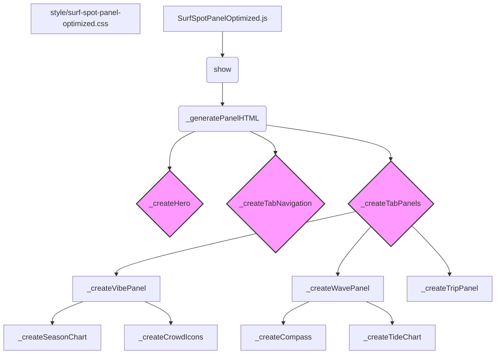

# Plan: Final Implemented Design for the Surf Spot Details Panel

## 1. Analysis of Previous Implementation

The initial `SurfSpotPanel` was overly complex. The goal of the redesign was to create a best-in-class, elegant, and informative panel that prioritizes the user. This document outlines the final, implemented design that achieves this goal.

## 2. Architectural Vision: The "At-a-Glance" Surf Dashboard

The implemented design follows these core principles:

- **Principle**: **Refined Tabbed Interface.** Information is organized into a three-tab system: "The Vibe," "The Wave," and "The Trip." This provides a clear narrative flow for the user.
- **Principle**: **Visual Hierarchy.** Typography, spacing, color, and iconography guide the user's eye to the most critical data points instantly.
- **Principle**: **Data Visualization.** Raw data is transformed into intuitive visual elements, including dynamic SVG charts and icons.
- **Principle**: **Mobile-First & Responsive.** The design is fully responsive, ensuring a seamless experience on all devices.
- **Principle**: **Component-Based Architecture.** The panel is built from smaller, logical, and reusable JavaScript functions for clarity and maintainability.

## 3. Final Information Architecture & Layout

The panel is structured with a fixed header, an optional alternative names section, a hero image, and a tabbed interface.

1.  **Header (Fixed):**
    *   `Spot Name` (h2, dynamically updated in the main panel header).
    *   `Close Button`.

2.  **Alternative Names (Below Header):**
    *   A simple text display of alternative names, left-aligned.

3.  **Hero Section:**
    *   Optimized `Hero Image` with a **strict 3:2 aspect ratio**.
    *   **Top-Left Overlay:** Clickable GPS coordinates with a globe icon, linking to Google Maps.
    *   **Bottom-Right Overlay:** `Wave Type` and `Difficulty Rating` tags.

4.  **Tabbed Content Area:**
    *   An accessible tablist (`role="tablist"`) for navigation.
    *   **Tab 1: The Vibe (Default)**
        *   `Description`: A concise, readable paragraph.
        *   `Season Chart`: A visual 12-month calendar showing best seasons, with the current month highlighted.
        *   `Info Grid`: An icon-led grid for "Crowds" and "Seabed".
        *   `Hazards`: A list where each item is prefixed with a high-visibility warning icon.
        *   `Local Vibe`: A summary of the atmosphere.
    *   **Tab 2: The Wave**
        *   `Ideal Conditions` description.
        *   `Paddle Out` description.
        *   `Compass Grid`: Side-by-side visual compasses for "Best Swell" and "Best Wind", with real-time indicators.
        *   `Tide Chart`: A visual sine wave with a filled background for best tides and a "lollipop" real-time marker.
        *   `Recommended Boards`.
    *   **Tab 3: The Trip**
        *   `Location`: Formatted location string (e.g., "North Coast").
        *   `Access & Parking`.
        *   `Facilities`.
        *   `Insider Tips` (if available).

## 4. Component-Based Code Structure

The `SurfSpotPanelOptimized` class manages the panel. UI generation is delegated to smaller, focused functions.

## 5. Technical Implementation

1.  **New Files Created:**
    *   `scripts/surf-map/surf-spot-panel-optimized.js`: The new JavaScript module.
    *   `style/surf-spot-panel-optimized.css`: The dedicated, scoped CSS file.
    *   `data/surf-spot-real-time.json`: The data structure for future real-time information.

2.  **JavaScript Logic (`surf-spot-panel-optimized.js`):**
    *   The main class fetches both static and real-time data.
    *   Reusable SVG icons are defined as constants.
    *   Helper functions (`_create...`) generate the HTML for each component, including dynamic SVGs for charts.
    *   Event listeners manage tab switching and panel visibility.

3.  **CSS Styling (`surf-spot-panel-optimized.css`):**
    *   Uses CSS Custom Properties for a consistent dark theme.
    *   Employs Flexbox and Grid for a fully responsive layout.
    *   Contains custom styles for all data visualization widgets and new UI elements.
