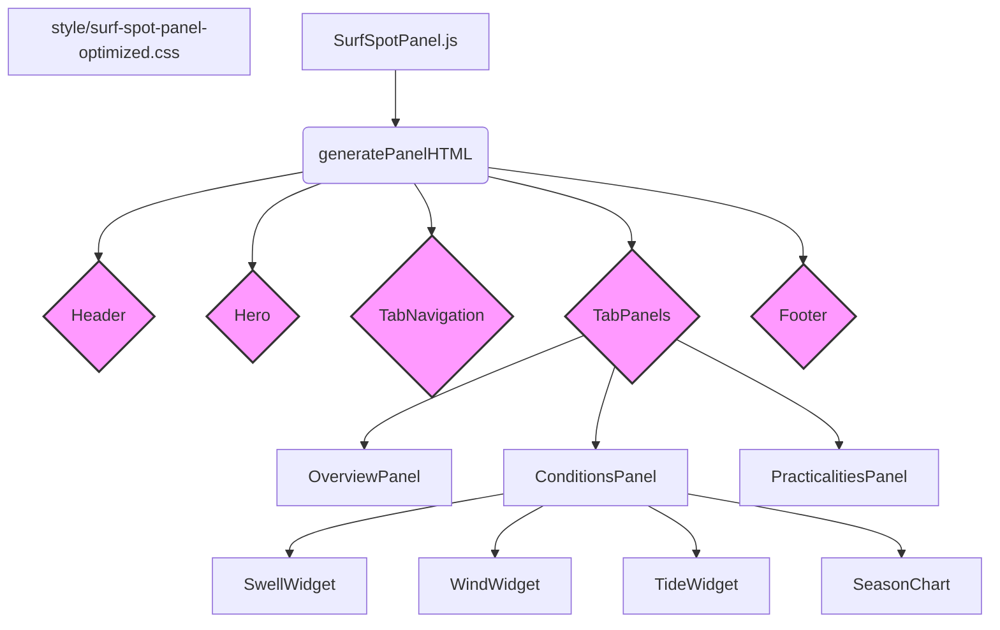

# Plan: Redesign of the Surf Spot Details Panel

## 1. Analysis of Current Implementation

The current `SurfSpotPanel` is overly complex and unintuitive. 
- **Problem**: A monolithic JavaScript class (`surf-spot-panel.js`) handles UI generation, state, and interactions, making it difficult to maintain.
- **Problem**: The UI relies on a tabbed and accordion-style layout, which hides critical information and requires excessive clicks.
- **Problem**: The CSS contains conflicting design systems and inefficient selectors, leading to visual inconsistency and wasted space.
- **Problem**: The user experience is poor, especially on mobile, due to the fragmented presentation of data.

## 2. Architectural Vision: The "At-a-Glance" Surf Dashboard

The goal is to create a best-in-class, elegant, and informative panel that prioritizes the user.

- **Principle**: **Refined Tabbed Interface.** Instead of a long scroll, information will be organized into a carefully planned, intuitive tab system. This maintains consistency with other site components and avoids overwhelming the user.
- **Principle**: **Visual Hierarchy.** Use typography, spacing, color, and iconography to guide the user's eye to the most critical data points instantly *within each tab*.
- **Principle**: **Data Visualization.** Transform raw data into intuitive visual elements like icons, progress bars, and custom-designed widgets.
- **Principle**: **Mobile-First & Responsive.** Design for a seamless experience on mobile that scales elegantly to desktop. The tab navigation will be optimized for touch.
- **Principle**: **Component-Based Architecture.** Break the panel into smaller, logical, and reusable components for clarity and maintainability.

## 3. New Information Architecture & Layout

The panel will be structured with a fixed header and hero, followed by a tabbed interface to organize the detailed content.

1.  **Header (Fixed):**
    *   `Spot Name` (h1)
    *   `Alternative Names` (subtitle)
    *   `Close Button` (accessibility-focused)

2.  **Hero Section (Fixed):**
    *   Optimized `Hero Image` with a **strict 3:2 aspect ratio**.
    *   **Key Info Overlay:**
        *   `Location Area` (e.g., "North Shore")
        *   `Difficulty Rating` (e.g., "Expert") - Visually distinct.
        *   `Wave Type` (e.g., "Reef Break")

3.  **Tabbed Content Area:**
    *   An accessible tablist (`role="tablist"`) for navigation.
    *   **Tab 1: Overview (Default)**
        *   `Description`: A concise, readable paragraph.
        *   `Ideal Conditions`: Summary of what makes the spot work.
        *   `Hazards`: A prioritized list with icons.
        *   `Local Vibe`: A summary of the atmosphere.
    *   **Tab 2: Conditions**
        *   **Swell Widget:** A visual compass for best swell directions.
        *   **Wind Widget:** A visual compass for best offshore wind directions.
        *   **Tide Widget:** A visual representation of the best tides.
        *   **Season Chart:** A simple, visual 12-month calendar showing best seasons.
        *   `Wave Direction` & `Bottom Type`.
    *   **Tab 3: Practicalities**
        *   `Access & Parking`: Clear, actionable text.
        *   `Paddle Out` & `Facilities`.
        *   `Recommended Boards`: A visual list of board icons with labels.
        *   `Crowd Factor` & `Water Quality`.
        *   `Additional Tips`.

4.  **Footer/Actions (Fixed):**
    *   `GPS Coordinates` (with a "Copy" or "View on Map" button).
    *   `Share Button`.

## 4. Component-Based Code Structure

The new `SurfSpotPanel` class will manage the overall panel and tab state. UI generation will be delegated to smaller, focused functions for each component and tab panel.

## 5. Technical Implementation Plan

1.  **Create New Files:**
    *   `scripts/surf-map/surf-spot-panel-optimized.js`: A new, lean JavaScript module for the redesigned panel.
    *   `style/surf-spot-panel-optimized.css`: A dedicated, scoped CSS file for the new panel, using BEM naming conventions to avoid style conflicts.

2.  **HTML Structure (`surf-spot-panel-optimized.js`):**
    *   Implement the new information architecture using semantic HTML5 (`article`, `section`, `header`, `h1`-`h6`, `figure`).
    *   Implement a fully accessible tab component (`role="tablist"`, `role="tab"`, `role="tabpanel"`, `aria-controls`, `aria-labelledby`, `aria-selected`).
    *   Create helper functions for each component (e.g., `_createHeader(spot)`, `_createTabs(spot)`).

3.  **CSS Styling (`surf-spot-panel-optimized.css`):**
    *   Use CSS Grid and Flexbox for a fully responsive layout.
    *   Implement the 3:2 aspect ratio for the hero image (`aspect-ratio: 3 / 2;`).
    *   Create custom styles for the new data visualization widgets (compass, season chart, etc.).
    *   Style the tab navigation and panels, ensuring clear active states.

4.  **JavaScript Logic (`surf-spot-panel-optimized.js`):**
    *   The main class will be responsible for rendering the panel and managing the state of the active tab.
    *   Event listeners will be added for tab navigation, close, share, and map buttons.
    *   Lazy loading for the hero image will be preserved.

## 6. TODO List

I will now update the TODO list to track the implementation of this revised plan.