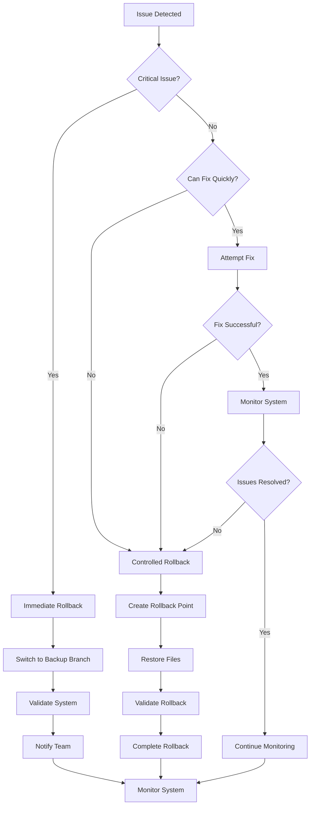

# Rollback Plan for Data Architecture Migration

## Overview
This rollback plan provides a comprehensive strategy to revert the data architecture migration if critical issues arise. The plan ensures minimal downtime and data loss while maintaining system stability.

## 1. Rollback Triggers

### 1.1 Critical Rollback Triggers
Any of the following conditions immediately trigger rollback:
- **Data Corruption**: Loss of release or collaborator information
- **Functionality Breakage**: Core features (audio playback, content loading) fail
- **Performance Degradation**: >50% increase in load times or memory usage
- **User Experience Issues**: Broken UI elements or navigation failures
- **Content Access Issues**: Stories, lyrics, or bios not loading correctly

### 1.2 Warning Triggers
Monitor these conditions that may indicate need for rollback:
- **Console Errors**: More than 5 JavaScript errors in browser console
- **Test Failures**: More than 20% of automated tests failing
- **User Reports**: Multiple user complaints about functionality
- **Content Inconsistencies**: Mismatched or missing content references

## 2. Backup Strategy

### 2.1 Pre-Migration Backups
```bash
# Create comprehensive backup before migration
git checkout -b data-architecture-backup
git add .
git commit -m "Pre-migration backup - $(date)"
git tag -a "backup-$(date +%Y%m%d-%H%M%S)" -m "Pre-migration backup"

# Create file system backup
cp -r . ../lavolcanica-backup-$(date +%Y%m%d-%H%M%S)

# Create data export backup
node scripts/backup/create-data-backup.js
```

### 2.2 Data Backup Script
Create `scripts/backup/create-data-backup.js`:
```javascript
/**
 * Creates a comprehensive backup of all data before migration
 */
import fs from 'fs';
import path from 'path';

const createBackup = () => {
    const timestamp = new Date().toISOString().replace(/[:.]/g, '-');
    const backupDir = `../backups/migration-${timestamp}`;
    
    // Create backup directory
    if (!fs.existsSync(backupDir)) {
        fs.mkdirSync(backupDir, { recursive: true });
    }
    
    // Backup critical data files
    const dataFiles = [
        'data/releases/release-data.js',
        'data/releases/featured-releases.js',
        'data/collaborators/collaborator-data.js',
        'data/collaborators/collaborator-songs.js',
        'data/content/release-stories.js',
        'data/content/release-lyrics.js',
        'data/content/collaborator-bios.js',
        'scripts/data-loader.js'
    ];
    
    dataFiles.forEach(file => {
        const source = path.join(process.cwd(), file);
        const dest = path.join(backupDir, file);
        
        // Create directory structure
        const destDir = path.dirname(dest);
        if (!fs.existsSync(destDir)) {
            fs.mkdirSync(destDir, { recursive: true });
        }
        
        // Copy file
        if (fs.existsSync(source)) {
            fs.copyFileSync(source, dest);
            console.log(`Backed up: ${file}`);
        }
    });
    
    // Create backup metadata
    const metadata = {
        timestamp: new Date().toISOString(),
        files: dataFiles,
        gitCommit: process.env.GIT_COMMIT || 'unknown',
        migrationPhase: 'pre-migration'
    };
    
    fs.writeFileSync(
        path.join(backupDir, 'backup-metadata.json'),
        JSON.stringify(metadata, null, 2)
    );
    
    console.log(`Backup created at: ${backupDir}`);
    return backupDir;
};

createBackup();
```

## 3. Rollback Procedures

### 3.1 Immediate Rollback (Emergency)
**Time to complete**: 5-10 minutes
**When to use**: Critical system failures

```bash
# 1. Switch to backup branch
git checkout data-architecture-backup

# 2. Force push to main if needed (EMERGENCY ONLY)
git push origin data-architecture-backup:main --force

# 3. Restart any services
npm run build && npm start
```

### 3.2 Controlled Rollback (Standard)
**Time to complete**: 15-30 minutes
**When to use**: Non-critical but significant issues

#### Step 1: Assess Current State
```bash
# Check current git state
git status
git log --oneline -10

# Run diagnostic tests
node tests/diagnostics.js
```

#### Step 2: Create Rollback Point
```bash
# Create rollback branch from current state
git checkout -b rollback-attempt-$(date +%Y%m%d-%H%M%S)
git add .
git commit -m "Rollback attempt - $(date)"
```

#### Step 3: Restore Files
```bash
# Restore data files from backup
git checkout data-architecture-backup -- data/
git checkout data-architecture-backup -- scripts/data-loader.js

# Restore application logic if needed
git checkout data-architecture-backup -- script.js
```

#### Step 4: Validate Rollback
```bash
# Run validation tests
node tests/rollback-validation.js

# Manual testing checklist
# - Homepage loads
# - Audio playback works
# - Content displays correctly
# - No console errors
```

#### Step 5: Complete Rollback
```bash
# Commit rollback changes
git add .
git commit -m "Rollback completed - $(date)"

# Switch back to main
git checkout main
git merge rollback-attempt-$(date +%Y%m%d-%H%M%S)
```

### 3.3 Partial Rollback (Selective)
**Time to complete**: 30-60 minutes
**When to use**: Specific components failing while others work

#### Selective Component Rollback
```javascript
// scripts/rollback/partial-rollback.js
/**
 * Selective rollback of specific components
 */
const rollbackComponents = {
    'data-structure': () => {
        // Rollback only data structure changes
        // Restore original release-data.js and collaborator-data.js
    },
    'application-logic': () => {
        // Rollback only script.js changes
        // Keep new data structure but restore old logic
    },
    'data-loader': () => {
        // Rollback only data-loader.js changes
        // Keep new data structure but old access methods
    }
};

export const executePartialRollback = (components) => {
    components.forEach(component => {
        if (rollbackComponents[component]) {
            console.log(`Rolling back ${component}...`);
            rollbackComponents[component]();
            console.log(`${component} rollback completed`);
        }
    });
};
```

## 4. Rollback Validation

### 4.1 Automated Validation
Create `tests/rollback-validation.js`:
```javascript
/**
 * Validates that rollback was successful
 */
export const validateRollback = () => {
    const validation = {
        dataIntegrity: { passed: 0, failed: 0, issues: [] },
        functionality: { passed: 0, failed: 0, issues: [] },
        performance: { passed: 0, failed: 0, issues: [] }
    };
    
    // Test 1: Original data structure restored
    try {
        // Check that collaborator-songs.js exists and works
        const collaboratorSong = dataLoader.getCollaboratorSong("tendido-cero-sentido");
        if (!collaboratorSong) {
            throw new Error("Collaborator songs not restored");
        }
        
        // Check that original release structure is intact
        const releases = dataLoader.releases;
        const tendidoRelease = releases.find(r => r.id === "tendido-cero-sentido");
        if (tendidoRelease.collaboratorIds) {
            throw new Error("New data structure still present");
        }
        
        validation.dataIntegrity.passed++;
    } catch (error) {
        validation.dataIntegrity.failed++;
        validation.dataIntegrity.issues.push(error.message);
    }
    
    // Test 2: Original functionality restored
    try {
        // Test collaborator display with songIds
        const cututo = dataLoader.collaborators.find(c => c.id === "cututo");
        if (!cututo.songIds || cututo.songIds.length === 0) {
            throw new Error("Original songIds not restored");
        }
        
        validation.functionality.passed++;
    } catch (error) {
        validation.functionality.failed++;
        validation.functionality.issues.push(error.message);
    }
    
    // Test 3: Performance restored
    try {
        const startTime = performance.now();
        const releases = dataLoader.releases;
        const collaborators = dataLoader.collaborators;
        const endTime = performance.now();
        
        const loadTime = endTime - startTime;
        if (loadTime > 100) { // 100ms threshold
            throw new Error(`Performance degraded: ${loadTime}ms`);
        }
        
        validation.performance.passed++;
    } catch (error) {
        validation.performance.failed++;
        validation.performance.issues.push(error.message);
    }
    
    return validation;
};
```

### 4.2 Manual Validation Checklist
```markdown
## Rollback Validation Checklist

### Data Structure
- [ ] collaborator-songs.js exists and is accessible
- [ ] release-data.js has original structure (no collaboratorIds)
- [ ] collaborator-data.js has songIds (not releaseIds)
- [ ] data-loader.js imports collaboratorSongs

### Functionality
- [ ] Homepage loads correctly
- [ ] Featured releases display
- [ ] Collaborator pages show correct songs
- [ ] Audio playback works for all tracks
- [ ] Content (stories, lyrics) loads correctly
- [ ] Language switching works

### Performance
- [ ] Load times are acceptable
- [ ] No memory leaks
- [ ] No console errors
- [ ] Smooth user interactions

### User Experience
- [ ] All navigation works
- [ ] No broken links or images
- [ ] Responsive design intact
- [ ] Multi-language content works
```

## 5. Rollback Communication

### 5.1 Internal Communication
```markdown
## Rollback Notification Template

**Subject**: Data Architecture Migration Rollback - [SEVERITY]

**Status**: [INITIATED | IN_PROGRESS | COMPLETED]

**Details**:
- **Reason**: [Brief explanation of rollback trigger]
- **Impact**: [Affected functionality and users]
- **Estimated Downtime**: [Time estimate]
- **Current Status**: [Current step in rollback process]

**Next Steps**:
- [ ] Complete rollback procedures
- [ ] Validate system functionality
- [ ] Monitor for issues
- [ ] Post-mortem analysis

**Contact**: [Point person for updates]
```

### 5.2 External Communication (if needed)
```markdown
## User Notification Template

**Subject**: Temporary System Maintenance

We're currently performing emergency maintenance to resolve technical issues. 

**Affected Features**:
- Music playback
- Collaborator profiles
- Content access

**Estimated Resolution**: [Time estimate]

We apologize for any inconvenience and appreciate your patience.
```

## 6. Post-Rollback Procedures

### 6.1 Issue Analysis
```javascript
// scripts/rollback/issue-analysis.js
/**
 * Analyzes what went wrong during migration
 */
export const analyzeMigrationFailure = () => {
    const analysis = {
        failurePoint: null,
        rootCause: null,
        impact: null,
        prevention: null
    };
    
    // Check logs for errors
    const errorLogs = getErrorLogs();
    const performanceMetrics = getPerformanceMetrics();
    
    // Analyze failure patterns
    if (errorLogs.includes('collaboratorSongs')) {
        analysis.failurePoint = 'Data structure migration';
        analysis.rootCause = 'Incomplete data migration';
        analysis.prevention = 'More thorough data validation';
    }
    
    if (performanceMetrics.loadTime > 200) {
        analysis.failurePoint = 'Performance regression';
        analysis.rootCause = 'Inefficient data access patterns';
        analysis.prevention = 'Performance testing before deployment';
    }
    
    return analysis;
};
```

### 6.2 Migration Retry Planning
After rollback, create improved migration plan:
```markdown
## Migration Retry Checklist

### Root Cause Analysis
- [ ] Identify specific failure point
- [ ] Document root cause
- [ ] Assess impact on users
- [ ] Review testing gaps

### Improved Migration Plan
- [ ] Address identified issues
- [ ] Enhance testing procedures
- [ ] Implement additional safeguards
- [ ] Create more granular rollback points

### Validation Requirements
- [ ] More comprehensive test coverage
- [ ] Performance benchmarks
- [ ] User acceptance testing
- [ ] Extended monitoring period
```

## 7. Rollback Decision Tree



## 8. Rollback Success Criteria

### 8.1 Technical Success
- All original functionality restored
- No data loss or corruption
- Performance at or better than baseline
- Zero console errors
- All automated tests passing

### 8.2 User Experience Success
- Seamless user experience
- No visible disruption
- All content accessible
- Multi-language functionality working
- Responsive design intact

This comprehensive rollback plan ensures that any issues during migration can be quickly and safely resolved, minimizing impact on users and maintaining system stability.